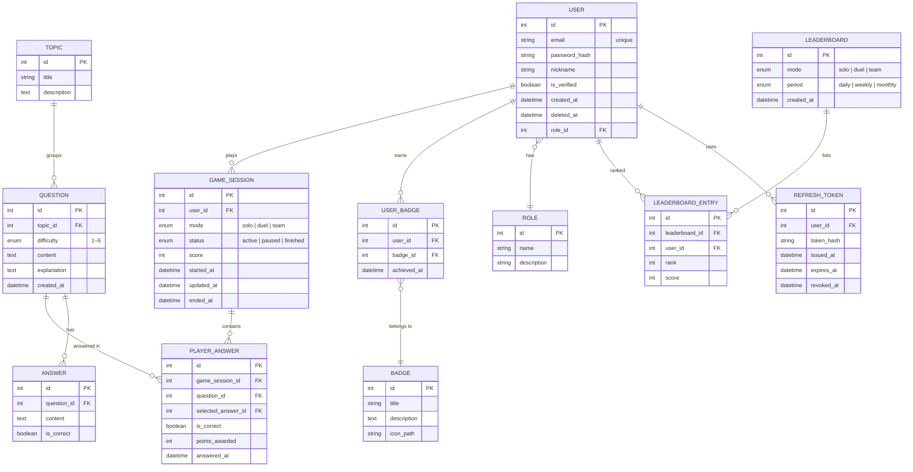

```mermaid
erDiagram
    USER {
        int id PK
        string email "unique"
        string password_hash
        string nickname
        boolean is_verified
        datetime created_at
        datetime deleted_at
        int role_id FK
    }

    ROLE {
        int id PK
        string name
        string description
    }

    GAME_SESSION {
        int id PK
        int user_id FK
        enum mode  "solo | duel | team"
        enum status "active | paused | finished"
        int score
        datetime started_at
        datetime updated_at
        datetime ended_at
    }

    QUESTION {
        int id PK
        int topic_id FK
        enum difficulty "1–5"
        text content
        text explanation
        datetime created_at
    }

    ANSWER {
        int id PK
        int question_id FK
        text content
        boolean is_correct
    }

    PLAYER_ANSWER {
        int id PK
        int game_session_id FK
        int question_id FK
        int selected_answer_id FK
        boolean is_correct
        int points_awarded
        datetime answered_at
    }

    TOPIC {
        int id PK
        string title
        text description
    }

    BADGE {
        int id PK
        string title
        text description
        string icon_path
    }

    USER_BADGE {
        int id PK
        int user_id FK
        int badge_id FK
        datetime achieved_at
    }

    LEADERBOARD {
        int id PK
        enum mode   "solo | duel | team"
        enum period "daily | weekly | monthly"
        datetime created_at
    }

    LEADERBOARD_ENTRY {
        int id PK
        int leaderboard_id FK
        int user_id FK
        int rank
        int score
    }

    REFRESH_TOKEN {
        int id PK
        int user_id FK
        string token_hash
        datetime issued_at
        datetime expires_at
        datetime revoked_at
    }

    %% Beziehungen
    USER     ||--o{ GAME_SESSION      : plays
    USER     ||--o{ USER_BADGE        : earns
    USER_BADGE }o--|| BADGE           : "belongs to"
    USER     }o--|| ROLE              : has
    GAME_SESSION ||--o{ PLAYER_ANSWER : contains
    QUESTION ||--o{ PLAYER_ANSWER     : "answered in"
    QUESTION ||--o{ ANSWER            : has
    TOPIC    ||--o{ QUESTION          : groups
    USER     ||--o{ LEADERBOARD_ENTRY : ranked
    LEADERBOARD ||--o{ LEADERBOARD_ENTRY : lists
    USER     ||--o{ REFRESH_TOKEN     : "uses"
```