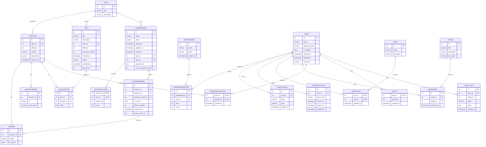

```mermaid
%%{init: {'securityLevel':'loose'}}%%
erDiagram
    %% Domain
    TOPIC {
        int id PK
        varchar title
        varchar description
    }
    QUESTION {
        int id PK
        int topic_id FK
        int difficulty
        varchar content
        varchar explanation
        timestamp created_at
    }
    ANSWER {
        int id PK
        int question_id FK
        varchar content
        bool is_correct
    }
    QUESTIONMEDIA {
        int id PK
        int question_id FK
        varchar url
        varchar media_type
    }
    QUIZ {
        int id PK
        varchar title
        varchar description
        int topic_id FK
        int difficulty
        int time_limit_minutes
        timestamp created_at
        varchar status
        timestamp published_at
        int play_count
    }
    QUIZQUESTION {
        int id PK
        int quiz_id FK
        int question_id FK
        int order
    }

    GAMESESSION {
        int id PK
        varchar mode
        varchar status
        timestamp started_at
        timestamp updated_at
        timestamp ended_at
        int quiz_id FK
        int topic_id FK
        json question_ids
        int current_question_index
    }
    SESSIONPLAYERS {
        int session_id PK, FK
        int user_id PK, FK
        int hearts_left
        int score
    }
    PLAYERANSWER {
        int id PK
        int session_id FK
        int question_id FK
        int selected_answer_id FK
        bool is_correct
        int points_awarded
        timestamp answered_at
        int answer_time_ms
    }

    LEADERBOARD {
        int id PK
        varchar mode
        varchar period
        timestamp created_at
    }
    LEADERBOARDENTRY {
        int id PK
        int leaderboard_id FK
        int user_id FK
        int rank
        int score
    }

    %% User & Auth
    USER {
        int id PK
        varchar email
        varchar password_hash
        bool is_verified
        timestamp created_at
        timestamp deleted_at
        varchar nickname
    }
    EMAILTOKENS {
        int id PK
        int user_id FK
        varchar token
        varchar type
        timestamp expires_at
    }
    REFRESHTOKEN {
        int id PK
        int user_id FK
        varchar token_hash
        timestamp issued_at
        timestamp expires_at
        timestamp revoked_at
    }

    ROLE {
        int id PK
        varchar name
        varchar description
    }
    USERROLES {
        int user_id PK, FK
        int role_id PK, FK
        timestamp granted_at
    }

    BADGE {
        int id PK
        varchar title
        varchar description
        varchar icon_path
    }
    USERBADGE {
        int id PK
        int user_id FK
        int badge_id FK
        timestamp achieved_at
    }
    USERQUESTIONSTAR {
        int user_id PK, FK
        int question_id PK, FK
        timestamp starred_at
    }
    WALLET {
        int user_id PK, FK
        int wisecoins
        timestamp updated_at
    }
    AUDITLOGS {
        int id PK
        int actor_id FK
        int target_id
        varchar action
        json meta
        timestamp created_at
    }

    %% Relations
    TOPIC ||--o{ QUESTION            : categorizes
    TOPIC ||--o{ QUIZ                : covers
    TOPIC ||--o{ GAMESESSION         : runs

    QUESTION ||--o{ ANSWER            : has
    QUESTION ||--o{ QUESTIONMEDIA     : has
    QUESTION ||--o{ QUIZQUESTION      : in
    QUESTION ||--o{ USERQUESTIONSTAR  : starred_by

    QUIZ ||--o{ QUIZQUESTION         : contains

    GAMESESSION ||--o{ SESSIONPLAYERS  : includes
    GAMESESSION ||--o{ PLAYERANSWER    : records
    PLAYERANSWER ||--o{ ANSWER          : selected

    LEADERBOARD ||--o{ LEADERBOARDENTRY : records
    USER        ||--o{ LEADERBOARDENTRY : appears_in

    USER ||--o{ EMAILTOKENS   : issues
    USER ||--o{ REFRESHTOKEN  : issues
    USER ||--o{ USERROLES     : assigned
    ROLE ||--o{ USERROLES     : receives

    USER ||--o{ USERBADGE     : earns
    BADGE ||--o{ USERBADGE     : awards

    USER ||--o{ USERQUESTIONSTAR : stars

    USER ||--o{ WALLET        : owns
    USER ||--o{ AUDITLOGS     : logs
```
